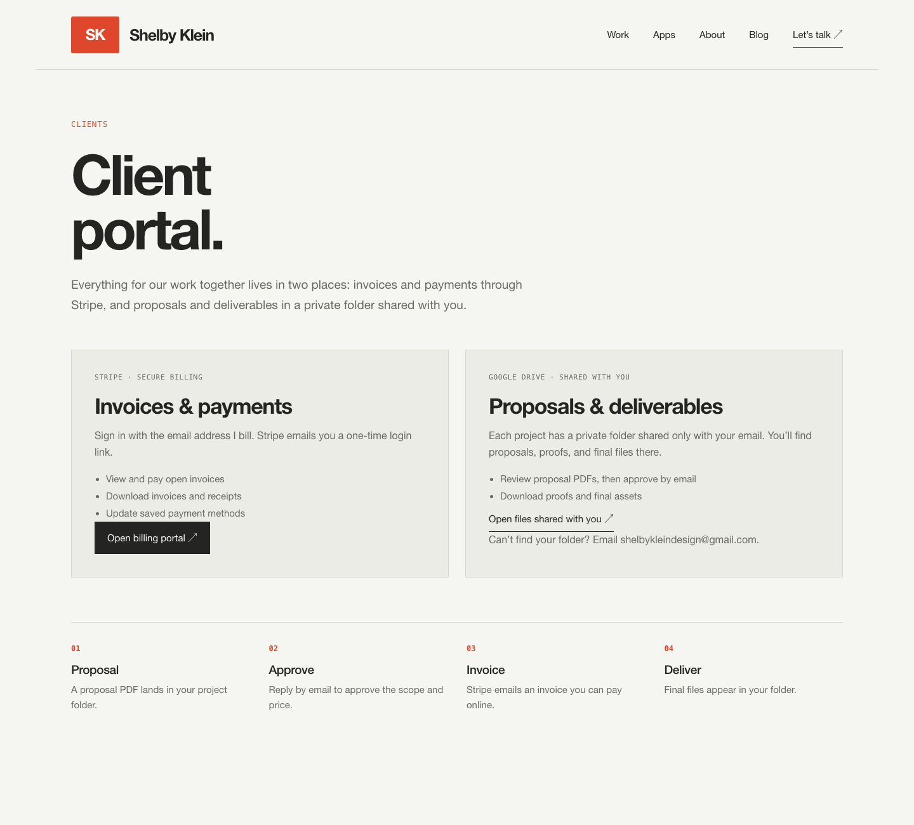
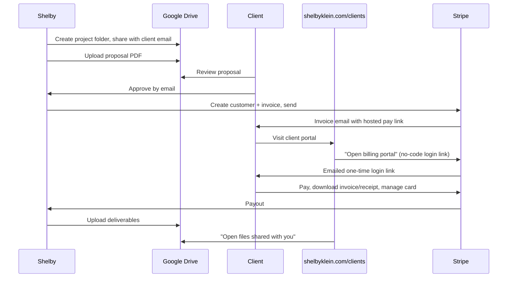

<!-- client-portal-2026-09-30 -->
# Client portal: invoicing and payments

**Issue:** https://github.com/shelbyklein/shelbyklein/issues/2 · **Tracker Trapper plan:** `42EFE976-43CA-4517-BC84-8866EF2B03D8` (todos CP-01…CP-08)

## Summary

Clients currently have no place on shelbyklein.com to pay invoices or pick up their files, and invoicing runs through Wave. This plan moves invoicing to a Stripe account Shelby controls directly and adds a `/clients` page to the site. The page sends clients to Stripe's hosted customer portal to view and pay invoices, and to a private Google Drive folder for proposals and deliverables. The site stays fully static: no backend, no stored client data, and no card data on shelbyklein.com.

## Problem

- **Today:** the site has no client-facing page. The routes are home, `/apps`, `/writing`, `/work/[id]`, and legacy redirects (`scripts/prepare-pages.mjs:27`). Header nav is Work / Apps / About / Blog / Let's talk (`components/site-header.tsx`). The footer nav is Writing / Resumé / LinkedIn / Back to top (`components/site-footer.tsx:21-26`). Screenshot: [current-header.png](assets/client-portal/current-header.png).
- **Today:** invoices go out from Wave, and the Stripe account runs through Wave, which probably controls it. Clients have no single place to see everything they owe, what they've paid, or their files.
- **Who it affects:** Shelby's freelance clients, and Shelby, who handles billing and file delivery by hand in separate tools.
- **Constraint:** the site is a static export to GitHub Pages (`.github/workflows/pages.yml`). It can't handle logins, sessions, or webhooks, so everything that needs authentication runs on Stripe and Google.

## Desired behavior

- A new `/clients` page with two entry points:
  1. **Invoices & payments** → the Stripe no-code customer portal login link. The client enters their billing email, and Stripe emails them a one-time login link. Once in, they can see invoice history, pay open invoices, download invoice and receipt PDFs, and update their payment method.
  2. **Proposals & deliverables** → Google Drive "Shared with me". Each client gets a folder shared only with their email address.
- A "Clients" link in the footer nav.
- Workflow: proposal PDF in Drive → client approves by email → Shelby creates and sends a Stripe invoice → client pays through the hosted invoice page or the portal → deliverables go into Drive.

Mockup: [clients-mockup.png](assets/client-portal/clients-mockup.png) (source: [clients-mockup.html](assets/client-portal/clients-mockup.html))

Flow ([flow.mmd](assets/client-portal/flow.mmd)):

## Settled decisions

- Stripe-hosted approach, with no backend (chosen over a custom portal with a serverless API or a third-party client tool).
- Leave Wave. New invoicing happens in a Stripe account Shelby controls directly.
- Proposals are PDFs in the client's Drive folder, approved by email. Stripe Quotes was rejected because it needs the paid Invoicing Plus plan and clients still can't accept a quote online (docs.stripe.com/quotes).
- Deliverables go in one private Google Drive folder per client, shared by email.
- Portal login uses Stripe's no-code login link (docs.stripe.com/customer-management/activate-no-code-customer-portal). Clients log in with an email that matches their Stripe customer record.

## Success criteria

1. A test-mode client can go from the `/clients` page to the Stripe portal, see a one-off invoice, and pay it with a test card. **Verified:** in the Stripe Dashboard in test mode, the invoice shows Paid (CP-03).
2. `/clients` renders to match the mockup at 1440px and 390px wide, with no horizontal scroll, and both buttons open the right destinations. **Verified:** local dev server plus headless screenshots (CP-04).
3. The static export includes `/clients/index.html`, and every check passes. **Verified:** `npm run lint`, `node scripts/check-content.mjs`, `node scripts/check-hero-scene.mjs`, and `npm run build:pages` all exit 0 (CP-06).
4. After deploy, the live `/clients` page links to the **live-mode** Stripe login link, and a real login email arrives for a test address. **Verified:** on production, by Shelby (CP-08).

## Deliverables

| Deliverable | End state |
|---|---|
| Stripe account controlled directly, portal configured, live login link | Configured by Shelby (human) |
| `app/clients/page.tsx`, styles in `app/globals.css`, footer link, `prepare-pages.mjs` route | Committed locally |
| `instructions/client-portal-operations.md`: onboarding and billing checklist | Committed locally |
| Push to `main` (deploys the site) | Awaiting Shelby's go-ahead |
| This plan + GitHub issue + Tracker Trapper plan | Published |

## Tasks

| ID | Owner | Task | Acceptance check |
|---|---|---|---|
| CP-01 | agent + human review | Set up a Stripe account Shelby controls directly: check whether the Wave-linked account gives full Dashboard access to Invoicing and Settings → Billing → Customer portal. If it doesn't, create a standalone account, then finish business verification and payouts. | In the Stripe Dashboard, Settings → Billing → Customer portal opens, and the account shows payouts enabled. |
| CP-02 | agent | In **test mode**, set branding, enable invoice history and payment-method updates in the customer portal, and activate the no-code login link. Share the test link URL. | A `https://billing.stripe.com/p/login/test_…` URL is recorded in this plan. |
| CP-03 | agent + human | Test-mode dry run: create a test customer with a real inbox email, send a one-off invoice, log in through the test link, and pay with test card 4242 4242 4242 4242. | The test invoice shows **Paid** in the Dashboard and appears in the portal's invoice history. |
| CP-04 | agent | Build `app/clients/page.tsx` to match the mockup, using existing tokens and classes, `sitePath()` for internal links, and the login and Drive URLs as constants at the top of the file (test link for now). | With `npm run dev`, `/clients` renders the two cards and the four steps. Screenshots at 1440 and 390 show no overflow. Both buttons open the expected URLs in a new tab. |
| CP-05 | agent | Add a "Clients" link to the footer nav, and add `'clients'` to `routes` in `scripts/prepare-pages.mjs`. | The footer shows "Clients" on every page, and `npm run build:pages` reports the route count including `clients`. |
| CP-06 | agent | Run every check. | `npm run lint`, `node scripts/check-content.mjs`, `node scripts/check-hero-scene.mjs`, and `npm run build:pages` all exit 0. |
| CP-07 | agent | Write `instructions/client-portal-operations.md`: onboarding a client (Stripe customer with the exact email, Drive folder shared with that email, proposal PDF), invoicing, what to send the client, and how to finish outstanding Wave invoices. | The file exists and covers every step in the flow diagram. |
| CP-08 | human gate | **Shelby switches Stripe to live mode and activates the live login link.** The agent swaps in the live URL, re-runs CP-06, and commits. **Shelby approves the push to `main`** (deploy), then checks the live page. | Live `/clients` returns 200 and links to a non-`test_` login URL, and a login email arrives for a live customer email. |

## Scope boundaries

**Excluded:** custom authentication or a backend; webhooks; storing client data in the repo; Stripe Quotes and Invoicing Plus; e-signatures; automated Drive folder creation; migrating Wave history or customers into Stripe; subscriptions or recurring billing; a header nav link (footer only).

**Must not change:** Wave data and any open Wave invoices (those finish in Wave); every existing route, redirect, and page; the hero scene; the `content/` data.

## Rollback

- **Site:** revert the portal commit and push to `main` (with Shelby's go-ahead). `/clients` disappears on the next Pages deploy. No data is involved.
- **Stripe:** deactivate the customer portal login link under Settings → Billing → Customer portal. Invoices already sent keep their hosted pay links. Nothing needs backing up, because the change is additive and doesn't touch Wave.

## Test plan

- `npm run lint`, `node scripts/check-content.mjs http://localhost:3000` (while `npm run dev` runs), `node scripts/check-hero-scene.mjs`, and `npm run build:pages`.
- **UI entry points:** the footer "Clients" link on the home page and on `/apps`. Rendered-state check: headless Chrome screenshots of `/clients` at 1440×1300 and 390×1800, compared against the mockup. Check both buttons' `href` values in the built `out/clients/index.html`.
- **Payments behavior:** the test-mode flow in CP-03, then the live login email in CP-08.

## Open questions (non-blocking)

- Can the Wave-linked Stripe account be used on its own, or does Shelby need a new standalone account? This is settled inside CP-01, and either answer works with the plan.
- If several Stripe customers share one email, Stripe prefers the one with an active subscription. With one-off invoices only, keep one customer per email; the operations doc says so.

## Work preparation

- **Scope:** confirmed by Shelby on 2026-09-30 (the settled decisions above).
- **Plan:** `instructions/client-portal.md`
- **Mode:** `linear`. It's a small, mostly sequential change to about four files, gated by Stripe setup, so parallel lanes wouldn't save time.
- **Models:** resumed linear executor is Codex `gpt-6.1-sol`, effort `medium` (verified from this session's runtime metadata). Previous executor: Opus 5.5 (`claude-opus-5-5`).
- **Handoff:** n/a (linear).
- **Now/later:** now; Shelby authorized implementation and dashboard setup.
- **Readiness:** pass · 2026-09-30 · R1–R13 pass; R3 current screenshot + mockup + flow diagram; R12 site revert + Stripe link deactivation

## Stripe setup progress (2026-09-30)

- Existing authenticated account: `acct_1EEgNGBhFKEUT5cx`, currently named "New business". Test customer-portal settings are accessible. Live business verification and payout readiness are not yet verified.
- Test portal login link activated: https://billing.stripe.com/p/login/test_cNidR89dBc1l7p59R7ffy00
- Invoice history and payment-method updates are enabled in test mode. This link is for testing only and must be replaced before deployment.
- Shelby authorized the agent to configure Stripe; CP-02 is now agent-owned. CP-01 account readiness and CP-03 test payment remain pending.
- Branding saved: existing SK favicon exported as a 256px PNG icon; brand and accent colors set to `#de472b`.
- Account display name set to `Shelby Klein` when Stripe required a name before creating an invoice.
- Created only a dedicated test customer (`cus_VM7mg19S4QvuZA`) with Shelby's email and a $1 test invoice (`in_1ULPWvBhFKEUT5cx5Iqzwxrf`, number `AEZ0QVLO-0001`). Invoice email and portal login email both arrived in the Work inbox. The authenticated portal lists this invoice and opens its hosted test payment page. Test payment remains unverified.
- Attempting to open the live dashboard redirects to test mode. The portal explicitly reports the account is unactivated; live readiness remains pending.
- Validation: static export, hero-scene check, changed-file oxlint, and `git diff --check` pass. Full lint still reports 25 unrelated existing errors; content check still reports the existing incomplete `steamdeckhq-one-year-later` article.
- Live activation can reuse existing verified business/payout details from Vispix or Buy Me a Coffee, or accept new details. Shelby must choose the source; no bank details are copied into this repository.

## Freelance business details (2026-09-30)

- Products/services description saved and read back: "I provide freelance website design, web development, and custom software programming services for businesses and individual clients. Clients pay invoices for agreed project work, including website builds, redesigns, and custom coding."
- Category: Software. Account-specific business website: https://shelbyklein.com. Statement descriptor: `SHELBYKLEIN.COM`; shortened prefix: `SHELBY`. Final review shows these values and no invalid descriptor warning.
- Selected included Radar Lite; skipped optional automatic tax setup and Climate contributions. Shared legal identity and imported payout details were not edited.
- Stripe activation is ready for final review. Its "Agree and submit" action certifies that all personal, legal, and payout information is complete and correct and agrees to Stripe's terms. Shelby must confirm these details before submission. CP-01 stays incomplete until activation and payout readiness are verified.
